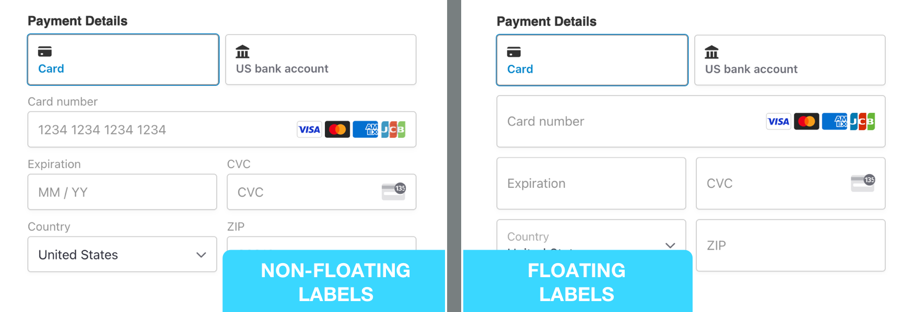
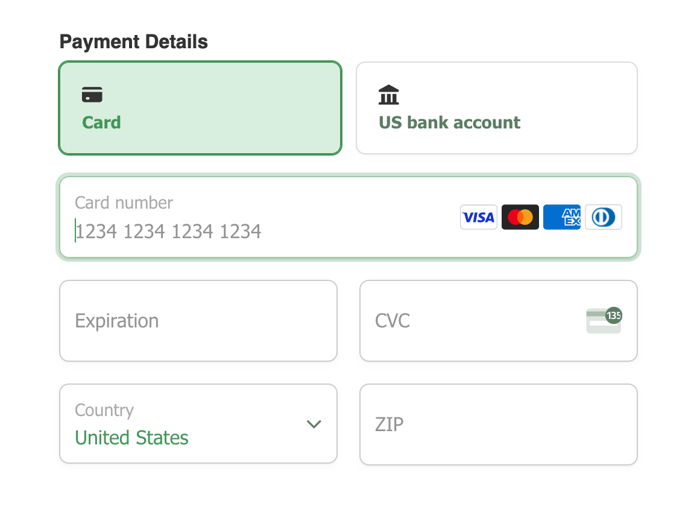

# Styling the "Payment Details" field on your payment form

MoonClerk has always supported applying custom CSS to your payment forms to create a pleasing and brand-matched experience for your payers. Due to PCI Security Standards, styling of the new Stripe Payment Element cannot be accomplished using CSS alone. If you need to provide additional styling to your payment form's payment details field, you'll need to use a combination of CSS and custom JSON styling.

This is an advanced feature and there is a possibility that implementing it incorrectly could cause issues with your checkout. We suggest reading over the documentation carefully and reviewing the entire checkout process after you have customized the form to ensure it functions properly.

## Styling around the payment details fields

If you want to style _around_ the payment details fields, you'll still want to use custom CSS. The Payment Element is contained in the `.StripePaymentElement` class. Applying styles to it will effect the border, padding, margin, etc. **Do not attempt to style anything with CSS inside of the `.StripePaymentElement` class. It will fail and could break your checkout.** Here is an example of applying custom CSS to the `.StripePaymentElement` class:

```css
.StripePaymentElement {
  background-color: white;
  height: 40px;
  padding: 10px 12px;
  border-radius: 4px;
  border: 1px solid transparent;
  box-shadow: 0 1px 3px 0 #e6ebf1;
}
```

## Styling inside the payment details fields

If you want to make any changes inside of the payment details fields, you'll need to add properly formatted JSON to the "JSON styling for the Payment Element" text area. This can be accessed on an edit page for a [Theme](https://app.moonclerk.com/themes/).

Stripe provides an [options reference](https://stripe.com/docs/elements/appearance-api) to help familiarize yourself with the options available.

**While the Stripe documentation shows options in JavaScript object format, MoonClerk requires that all option configuration be in JSON format. While very similar, there are key differences.**

**BAD!** ❌

```javascript
{
  theme: "none",
  variables: {
    colorDanger: "#A34033",
    colorIconTabSelected: "#333333",
    colorIconTab: "#333333",
    colorPrimary:"#f20055",
    colorText: "#30313d"
  },
  rules: {
    ".Tab": {
      border: "1px solid #E0E6EB",
    },
    ".Tab:hover": {
      color: "var(--colorText)",
    },
    ".Tab--selected": {
      borderColor: "#E0E6EB",
    },
  }
}
```

**GOOD** ✅

```json
{
  "theme": "none",
  "variables": {
    "colorDanger": "#A34033",
    "colorIconTabSelected": "#333333",
    "colorIconTab": "#333333",
    "colorPrimary": "#f20055",
    "colorText": "#30313d"
  },
  "rules": {
    ".Tab": {
      "border": "1px solid #E0E6EB"
    },
    ".Tab:hover": {
      "color": "var(--colorText)"
    },
    ".Tab--selected": {
      "borderColor": "#E0E6EB"
    }
  }
}
```

⚠️ **All Payment Element form field styling should exist (as valid JSON) within a single object, with all keys and values being wrapped in double quotes. We recommend composing your valid JSON in an external text editor or using a linter to assure you are providing valid JSON.**

### Floating Labels

You can choose between "floating" labels or non floating labels (the default). To enable floating labels, specicfy the option in the top-level. For example:

```json
{
  "labels": "floating"
}
```



### Variables

Variables control the appearance of the different form components. The variables option works like CSS variables. You can specify CSS values for each variable and reference other variables with the var(--myVariable) syntax.

| Variable          | Description                                                                                                                                                          |
| ----------------- | -------------------------------------------------------------------------------------------------------------------------------------------------------------------- |
| `fontFamily`      | The font family used throughout Elements. Elements supports custom fonts by passing the fonts option to the Elements group.                                          |
| `fontSizeBase`    | The font size that’s set on the root of the Element. By default, other font size variables like fontSizeXs or fontSizeSm are scaled from this value using rem units. |
| `spacingUnit`     | The base spacing unit that all other spacing is derived from. Increase or decrease this value to make your layout more or less spacious.                             |
| `borderRadius`    | The border radius used for tabs, inputs, and other components in the Element.                                                                                        |
| `colorPrimary`    | A primary color used throughout the Element. Set this to your primary brand color.                                                                                   |
| `colorBackground` | The color used for the background of inputs, tabs, and other components in the Element.                                                                              |
| `colorText`       | The default text color used in the Element.                                                                                                                          |
| `colorDanger`     | A color used to indicate errors or destructive actions in the Element.                                                                                               |

[Much of this documentation was taken from Stripe](https://stripe.com/docs/elements/appearance-api?platform=web#variables). Visit Stripe's documentation for more in-depth information including more options not mentioned here.

```json
{
  "variables": {
    "colorPrimary": "#439558",
    "colorBackground": "#d8eede",
    "colorText": "#439558",
    "colorDanger": "#ff3f23",
    "fontFamily": "Tahoma, sans-serif",
    "spacingUnit": "6px",
    "borderRadius": "8px"
  }
}
```

### Rules

After defining your variables, use rules to seamlessly integrate Elements to match the design of your theme. Rules are defined by combining a high-level name with modifiers, together referred to as 'selectors'. All of the following are vaild selectors.

- `.Tab, .Label, .Input`
- `.Tab:focus`
- `.Input--invalid, .Label--invalid`
- `.Input::placeholder`

Here is a list of basic components

- `.Tab`
- `.Label`
- `.Input`
- `.PickerItem`

Here is a list of basic components with some of their modifiers

- `.Tab:focus`
- `.Tab--selected`
- `.Label--invalid`
- `.Input:focus`
- `.Input--invalid`

```json
{
  "rules": {
    ".Tab, .Input, .PickerItem": {
      "borderRadius": "var(--borderRadius)"
    },
    ".Tab": {
      "border": "1px solid #dddddd",
      "boxShadow": "0px 1px 1px rgba(0, 0, 0, 0.03), 0px 3px 6px rgba(18, 42, 66, 0.02)"
    },
    ".Tab--selected": {
      "backgroundColor": "var(--colorBackground)",
      "border": "1px solid var(--colorPrimary)"
    },
    ".Label--invalid, .Input--invalid, .Error": {
      "color": "var(--colorDanger)"
    },
    ".Input--invalid": {
      "boxShadow": "0 1px 1px 0 rgba(0, 0, 0, 0.07), 0 0 0 2px var(--colorDanger)"
    }
  }
}
```

[Much of this documentation was taken from Stripe](https://stripe.com/docs/elements/appearance-api?platform=web#rules). Visit Stripe's documentation for more in-depth information including more options not mentioned here.

### Putting it all together

Here is all the the above sections put together.

```json
{
  "labels": "floating",
  "variables": {
    "colorPrimary": "#439558",
    "colorBackground": "#d8eede",
    "colorText": "#439558",
    "colorDanger": "#ff3f23",
    "fontFamily": "Tahoma, sans-serif",
    "spacingUnit": "6px",
    "borderRadius": "8px"
  },
  "rules": {
    ".Tab, .Input, .PickerItem": {
      "borderRadius": "var(--borderRadius)"
    },
    ".Tab": {
      "border": "1px solid #dddddd",
      "boxShadow": "0px 1px 1px rgba(0, 0, 0, 0.03), 0px 3px 6px rgba(18, 42, 66, 0.02)"
    },
    ".Tab--selected": {
      "backgroundColor": "var(--colorBackground)",
      "border": "1px solid var(--colorPrimary)"
    },
    ".Label--invalid, .Input--invalid, .Error": {
      "color": "var(--colorDanger)"
    },
    ".Input--invalid": {
      "boxShadow": "0 1px 1px 0 rgba(0, 0, 0, 0.07), 0 0 0 2px var(--colorDanger)"
    }
  }
}
```

The above styling will yield a result similar to this:


