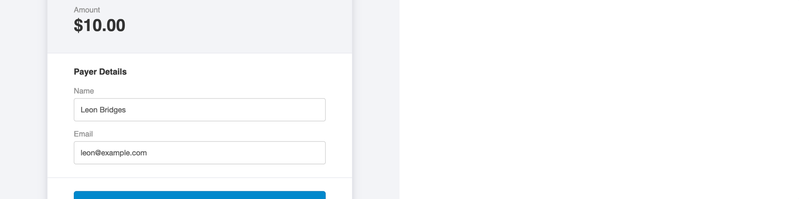

# Integrating With Your Site

## Prefilling a Payment Form with data

You can pass parameters to the MoonClerk Payment Form that will make select
fields pre-filled. This is a great option if you already have customer
information and would like to link to a payment form from an app you control.

### Available Parameters

| Name           | Example value      |
| -------------- | ------------------ |
| `amount_cents` | `1000`             |
| `cid`          | `12-5355-55`       |
| `email`        | `leon@example.com` |
| `name`         | `Leon+Bridges`     |

Note: Payment Form must have an amount that is decided at checkout.
[See below](#passing-a-custom-id) for more info on Custom IDs

You can set the URL parameters of the form like so:

`https://app.moonclerk.com/pay/8h7frjfytj?amount_cents=1000&name=Leon+Bridges&email=leon@example.com`

Doing so will yield the following result:



[See embedding documentation](/embedding.md) for info on how to accomplish this
with an embedded checkout.

## Passing a Custom ID

### Linked Checkout

In order to track a known user from your site through a MoonClerk checkout you
can pass a `cid` parameter (short for custom_id) into the checkout. If you are
linking to your checkout you can simply tack it onto the URL. If your user ID
is 234, you can add the following parameter to your checkout URL:

`https://app.moonclerk.com/pay/8h7frjfytj`

becomes

`https://app.moonclerk.com/pay/8h7frjfytj?cid=234`

**A note about security. All traffic to and from MoonClerk is encrypted with
SSL which includes the URL. If you are concerned about sending real IDs over
the URL you can create a MD5 or SHA hash based on the id and timestamp, store
it with the user in your database, and pass that parameter instead of the
actual ID.**

### Embedded Checkout

If you are using [an embed code for your form](/embedding.md), you'll need
to dynamically add the `cid` to the `opts` object. Looking inside the embed
code, you'll find an `opts` object similar to this:

`opts={"checkoutToken":"8h7frjfytj","width":"100%"};`

You'll need to add the `cid` as follows:

`opts={"checkoutToken":"8h7frjfytj","width":"100%","cid":"234"};`

Here you can see the entire embed snippet with the updated `opts` object:

```html
<div id="mc8h7frjfytj">
  <a href="https://app.moonclerk.com/pay/8h7frjfytj">My Payment Form</a>
</div>
<script type="text/javascript">
  var mc8h7frjfytj;
  (function (d, t) {
    var s = d.createElement(t),
      opts = { checkoutToken: "8h7frjfytj", width: "100%", cid: "234" };
    s.src = "https://d2l7e0y6ygya2s.cloudfront.net/assets/embed.js";
    s.onload = s.onreadystatechange = function () {
      var rs = this.readyState;
      if (rs) if (rs != "complete") if (rs != "loaded") return;
      try {
        mc8h7frjfytj = new MoonclerkEmbed(opts);
        mc8h7frjfytj.display();
      } catch (e) {}
    };
    var scr = d.getElementsByTagName(t)[0];
    scr.parentNode.insertBefore(s, scr);
  })(document, "script");
</script>
```

## Retrieving the Custom ID

### Passing `custom_id` Parameter via the Redirect URL (Simpler)

This is the simplest way to retrieve successful checkout information. When
creating/editing your payment form in the MoonClerk dashboard, choose
"Redirect to another web page" in the Confirmation section. Add your redirect
URL. For this example we will use `http://example.com/success.html`.

We allow for a `custom_id` parameter to be appended to your redirect URL. If
a custom ID is passed into the checkout, it will be available for use in the
redirect URL. Let's say you have a $10/month recurring checkout and you are
sending the `cid` into the checkout, you could create a redirect URL as
follows:

`http://example.com/success.html?custom_id={{custom_id}}`

After a successful checkout, those curly brackets will be replaced with the
actual value. You can set the parameter names to whatever you like. With a
cid of 123, it my look like:

`http://example.com/success.html?custom_id=123`

You can then use the [MoonClerk API](/api/README.md) retrieve MoonClerk
customer or payment data and correlate the custom_id. The payload for both
customers and payments contain a `custom_id` field which should match the
`cid` you provided.

### Using MoonClerk Webhooks (More Complex)

The [Customer](/webhooks.md#example-customer-payload) and
[Payment](/webhooks.md#example-payment-payload) webhook payloads should
contain a `custom_id` field which should match the `cid` you provided.

[See our webhook documentation page.](/webhooks.md)

## Getting a Checkout Token in the Redirect URL

You can provide a special `{{checkout_token}}` variable in the Payment Form's
redirect URL. When configured, after a successful checkout we will replace
the variable with a token that is unique to each checkout.

For example, if this is the configured redirect URL on the MoonClerk Payment
Form:

`http://example.com/success.html?token={{checkout_token}}`

The actual redirect URL after checkout will look something like this.

`http://example.com/success.html?token=m6qQHPi56gnjShmGx4P2yeKz`

This same token can be seen in the [webhook payload data](/webhooks.md). It
is also available in the [Payment API response](/api/v1/payments.md)
(if the checkout was one-time) and
[Customer API response](/api/v1/customers.md).

---

⚠️ **Important!** Previous versions of this document referenced `payment_id`
and `customer_id` parameters for the redirect URL. These parameters are
no longer supported. As a replacement, we recommend to use webhooks.
