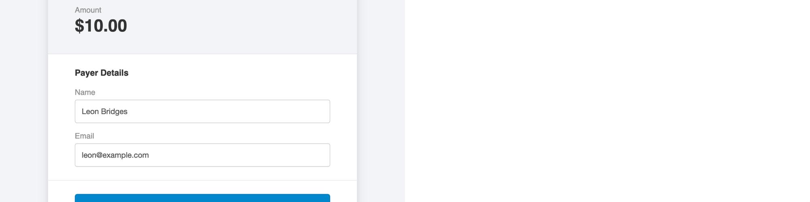

# Integrating With Your Site

We offer two ways to integrate with your site:

1. Seeding the checkout with the data so your user doesn't have to enter it
2. Passing a custom ID in order to track an existing user through a checkout

## Seeding a Checkout with Pre-filled Data

You can pass parameters to the MoonClerk checkout that will make certain fields pre-filled. This is a great option if you already have customer information and would like to link to a checkout from an app you control.

###  URL Structure

You seed data by using [query parameters in the URL](https://www.semrush.com/blog/url-parameters/). Parameters are generally in the form of `key=value`. When you have multiple parameters, separate them with an ampersand (`&`).

It is important that all values (after the `=`) are URL-encoded or the URL will not work. For example, if you want to pass the name "Leon Bridges", you should encode it as "Leon%20Bridges".

### Common Parameters

The following parameters are available for all payment forms:

| Name           | Example value      |
| -------------- | ------------------ |
| `name`         | `Leon+Bridges`     |
| `email`        | `leon@example.com` |

You can also seed the amount provided that your payment form has the amount option set to "Decided at Checkout".

| Name           | Example value      |
| -------------- | ------------------ |
| `amount_cents` | `1000`             |

You can set the URL parameters of the form like so, where "8h7frjfytj" is your form token:

`https://app.moonclerk.com/pay/8h7frjfytj?amount_cents=1000&name=Leon+Bridges&email=leon@example.com`

Doing so will yield the following result:



[See embedding documentation](/embedding.md) for info on how to accomplish this
with an embedded checkout.

### Custom Field Parameters (Additional Information)

You are able to seed the initial values for many custom field types.

The way you seed custom fields relies on how you named them in the form builder. Specifically, there is a `key` field that, by default, is the lowercase snake-cased version of the name of the field. You are free to override this behavior by setting the`key` field to any value you want. Whatever value you set will be used as the parameter name to seed that particular field.

Given a custom field named "Hat Size", the default key would be "hat_size". If you want to use a different key, you can set the `key` field to any value you want. For example, you could set the `key` field to "size" to use "size" as the parameter name to seed the "Hat Size" field. Please note that when seeding fields that have pre-defined values in the form builder (such as radio buttons, checkboxes, and drop-downs), the values that you seed are case-sensitive and must match the values in the form builder.

For example, to seed a text field with the key of "size", you would use:

`https://app.moonclerk.com/pay/8h7frjfytj?fields[size]=XL`

#### Seed Multiple Fields

To add multiple seeded values, you will add each one the URL connecting them with an ampersand (&). For instance, if you had 3 text fields with the following keys: size, color, and style, you would use:

`https://app.moonclerk.com/pay/8h7frjfytj?fields[size]=XL&fields[color]=Red&fields[style]=Flat`

#### URL Encoding

It is important to be aware that **all values must be URL encoded**. For example, if you want to seed a text field with the value "Red & Blue", you would use:

`https://app.moonclerk.com/pay/8h7frjfytj?fields[color]=Red%20%26%20Blue`

You can use the following tool to help you encode your values: https://www.url-encode-decode.com/

#### Availability and Naming

| Field Type         | Seeding Supported? |  Example |
| ------------------ | ------------------ | -------- |
|  Address           | Yes                | See below, complex |
|  Checkboxes        | Yes                | See below, complex |
|  Date              | Yes                | September 15, 2025, `fields[my_field_key]=2025-09-15` |
|  Email             | Yes                | jimbo@example.com, `fields[my_field_key]=jimbo%40example.com` |
|  File Upload       | No                 | None |
|  Phone Number      | Yes                | 864-555-1212, `fields[my_field_key]=864-555-1212` OR for international numbers, `fields[my_field_key]=442012341234` |
|  Radio Buttons     | Yes                | Must match a predefined value set in the field. If shirt_size is S, M, or L, `fields[my_field_key]=S` (values are case-sensitive) |
|  Drop Down         | Yes                | Must match a predefined value set in the field. If shirt_size is S, M, or L, `fields[my_field_key]=S` (values are case-sensitive) |
|  Paragraph Text    | Limited            | See text_field. You can seed this with a single line of text but URLs don't support line breaks |
|  Single Line Text  | Yes                | Johnny Boy, `fields[my_field_key]=Johnny%20Boy` |
|  Time              | Yes                | 12:45 PM, `fields[my_field_key]=12:45%20PM` |
|  Website (URL)     | Yes                | https://google.com, `fields[my_field_key]=https%3A%2F%2Fgoogle.com` |

*Note: You will need to replace `my_field_key` with the actual field key you are using in your MoonClerk form.*

#### Address Custom Fields

Because the Address type custom field is a complex field containing multiple fields, you must pass each field as a separate parameter. For example, if you have an Address field called `address`, you can pass the street, city, state, and zip code like this: `fields[address][line1]=123%20Main%20St&fields[address][city]=Anytown&fields[address][state]=CA&fields[address][postal_code]=12345`. Please note that for country codes, you must use the two letter country code in uppercase.

| Address Part      | Key             | Example |
| ----------------- | --------------- | ------------------------------------------- |
| Street Address    | line1           | fields[my_field_key][line1]=123%20Main%20St  |
| Second Line       | line2           | fields[my_field_key][line2]=Apt%201          |
| City              | city            | fields[my_field_key][city]=Anytown           |
| State             | state           | fields[my_field_key][state]=CA               |
| Postal Code/Zip   | postal_code     | fields[my_field_key][postal_code]=12345      |
| Country           | country_code    | fields[my_field_key][country_code]=US        |


#### Checkbox Custom Fields

There is a special style to use for check boxes as the field can contain multiple values. For example, if you have a field called `interests` with values `sports`, `music`, and `art`, you can pass multiple values like this: `fields[interests][]=sports&fields[interests][]=music`. You must add the `[]` to the field name to indicate that it is an array of values even if there is only one value. (values are case-sensitive)

###  Seeding Custom Fields when using an Embedded Checkout

Since you don't have direct access to the URL, you can pass your custom field key/value pairs in the `fields` object in the `opts` variable of the embed code.

```
opts = {
  checkoutToken: "8h7frjfytj",
  fields: {
    'fields[nickname]': 'Jimmy',
    'fields[birthday]': '2025-09-15',
    'fields[address][line1]': '123 Main St',
    'fields[interests][]': 'sports',
    'fields[interests][]':  'music'
  }
};
```

You will follow all the same naming conventions mentioned in the previous sections for the parameter name.

## Tracking a user through a checkout with a custom ID

Sometimes you want to track an existing user on your system through a MoonClerk checkout. Here is the basic flow you will need to follow.

1. Create or retrieve your identifier for the customer
2. Pass the identifier as a custom ID (`cid`) param when the checkout is loaded
3. Set up and configure a webhook endpoint in the MoonClerk dashboard.
4. When a checkout is completed, you will receive a webhook with a payment (for one-off payments) or customer (for recurring plans) payload
5. Compare the `custom_id` field in the payload with the identifier that you passed into the checkout and store the MoonClerk payment ID or customer ID in your database.
6. Then you'll be able to look up a payment using the payment endpoint or a customer using the customer endpoint in the MoonClerk API.

### Passing the custom ID to a checkout

#### When using a linked checkout

If your user ID is 234, you can add the following parameter to your checkout URL:

`https://app.moonclerk.com/pay/8h7frjfytj`

becomes

`https://app.moonclerk.com/pay/8h7frjfytj?cid=234`

**A note about security. All traffic to and from MoonClerk is encrypted with SSL which includes the URL. If you are concerned about sending real IDs over the URL you can create a MD5 or SHA hash based on the id and timestamp, store it with the user in your database, and pass that parameter instead of the actual ID.**

#### When embedding a checkout

If you are using [an embed code for your form](/embedding.md), you'll need to dynamically add the `cid` to the `opts` object. Looking inside the embed code, you'll find an `opts` object similar to this:

`opts={"checkoutToken":"8h7frjfytj","width":"100%"};`

You'll need to add the `cid` as follows:

`opts={"checkoutToken":"8h7frjfytj","width":"100%","cid":"234"};`

Here you can see the entire embed snippet with the updated `opts` object:

```html
<div id="mc8h7frjfytj">
  <a href="https://app.moonclerk.com/pay/8h7frjfytj">My Payment Form</a>
</div>
<script type="text/javascript">
  var mc8h7frjfytj;
  (function (d, t) {
    var s = d.createElement(t),
      opts = { checkoutToken: "8h7frjfytj", width: "100%", cid: "234" };
    s.src = "https://d2l7e0y6ygya2s.cloudfront.net/assets/embed.js";
    s.onload = s.onreadystatechange = function () {
      var rs = this.readyState;
      if (rs) if (rs != "complete") if (rs != "loaded") return;
      try {
        mc8h7frjfytj = new MoonclerkEmbed(opts);
        mc8h7frjfytj.display();
      } catch (e) {}
    };
    var scr = d.getElementsByTagName(t)[0];
    scr.parentNode.insertBefore(s, scr);
  })(document, "script");
</script>
```

### Retrieving the MoonClerk ID associated with your custom ID

The [Customer](/webhooks.md#example-customer-payload) and
[Payment](/webhooks.md#example-payment-payload) webhook payloads should contain a `custom_id` field which should match the `cid` you provided.

You will want to query your resource using the `custom_id` and then store the associated `id` field so you can then use it to find the MoonClerk resource via our API.

---

⚠️ **Important!** Previous versions of this document referenced `payment_id` and `customer_id` parameters for the redirect URL. These parameters are no longer supported. As a replacement, we recommend to use webhooks.
